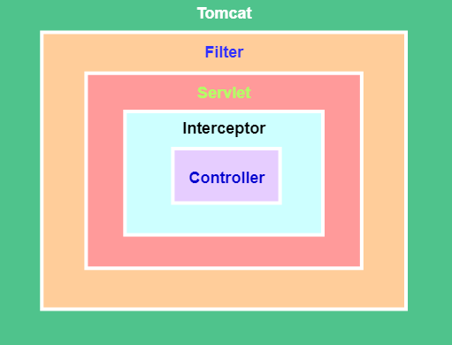

# 笔记
## 过滤器和拦截器

### 实现原理不同

过滤器和拦截器 底层实现方式大不相同，过滤器 是基于函数回调的，拦截器 则是基于Java的反射机制（动态代理）实现的。

- 拦截器是基于java的反射机制的，而过滤器是基于函数回调

- 过滤器依赖与servlet容器，而拦截器不依赖与servlet容器

- 拦截器只能对action请求起作用，而过滤器则可以对几乎所有的请求起作用

- 拦截器可以访问action上下文、值栈里的对象，而过滤器不能

- 在action的生命周期中，拦截器可以多次被调用，而过滤器只能在容器初始化时被调用一次

### 过滤器
依赖于servlet容器。在实现上基于函数回调，可以对几乎所有请求进行过滤，但是缺点是一个过滤器实例
只能在容器初始化时调用一次。使用过滤器的目的是用来做一些过滤操作，获取我们想要获取的数据，比如：
在过滤器中修改字符编码；在过滤器中修改HttpServletRequest的一些参数，包括：过滤低俗文字、危险字符等
### 拦截器
依赖于web框架，在SpringMVC中就是依赖于SpringMVC框架。在实现上基于Java的反射机制，属于面向切面
编程（AOP）的一种运用。由于拦截器是基于web框架的调用，因此可以使用Spring的依赖注入（DI）进行一些
业务操作，同时一个拦截器实例在一个controller生命周期之内可以多次调用。但是缺点是只能对controller
请求进行拦截，对其他的一些比如直接访问静态资源的请求则没办法进行拦截处理

## TestNG 
TestNG是Test Next Generation的缩写，它的灵感来自于JUnit和NUnit，在它们基础上增加了很多很牛的功能，比如说：
- 注解。
- 多线程，比如所有方法都在各自线程中，一个测试类一个线程等。
- 验证代码是否多线程安全。
- 灵活的测试配置。
- 支持数据驱动（@DataProvider）。
- 支持参数化。
- 强大的执行机制（不需要TestSuite）。
- 能跟各种工具结合（比如IDEA、Maven等）。
- 内嵌BeanShell。
- 提供运行时和日志的JDK函数（不需要添加dependencies）。
- 提供应用服务器测试依赖的方法。
## flowable
自动执行事件 serviceTask 
主要属性  flowable:class= "全类名"
该类需要实现 JavaDelegate 并实现方法 execute 来写自动执行的事件

HistoryActivityInstanceQuery  查看活跃过的历史数据  每个节点的数据 (获取节点名称 流程处理事件的时间)

## 知识图谱
自然语言的处理  
三元组  spo标注   实体之间的关系
什么是知识图谱
根据一个图模型把有关联的联系到一起,将信息连起来.

### 实际应用: 
搜索引擎(百度搜索 北京城的面积  北京这个实体又面积属性可以直接在第一个结果展示面积大小)
医疗领域的应用 :查询方便  智能问答助手  图模型能帮我们快速检索  只要有数据就能搭建图模型
金融领域的应用: 风控 
推荐系统: 抖音推荐 

### 技术要素:
- 表示 Property Graph   RDF图模型  OWL本体建模  规则表示
- 存储 关系图存储  原生图存储   图查询语言
- 抽取 概念抽取  实体识别  关系抽取 事件抽取
- 融合 实体对齐  本体映射  概念匹配
- 推理 符号推理  规则推理  图推理  神经网络推理
- 问答 问句推理  语义解析  答案生成
- 分析  图算法  图嵌入  图神经网络  图可视化
- 其他  众包  Scene Graph @CV   Semantic LOT

